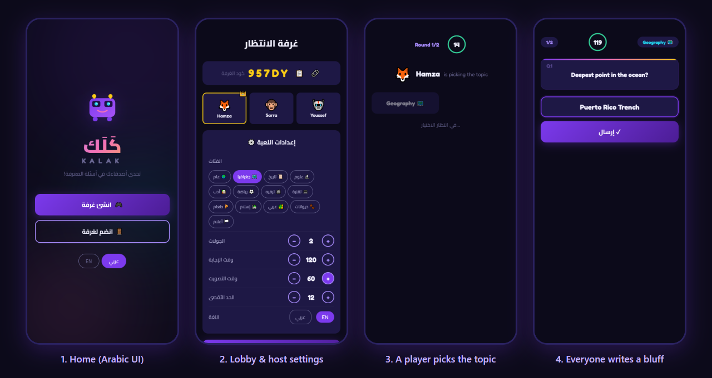
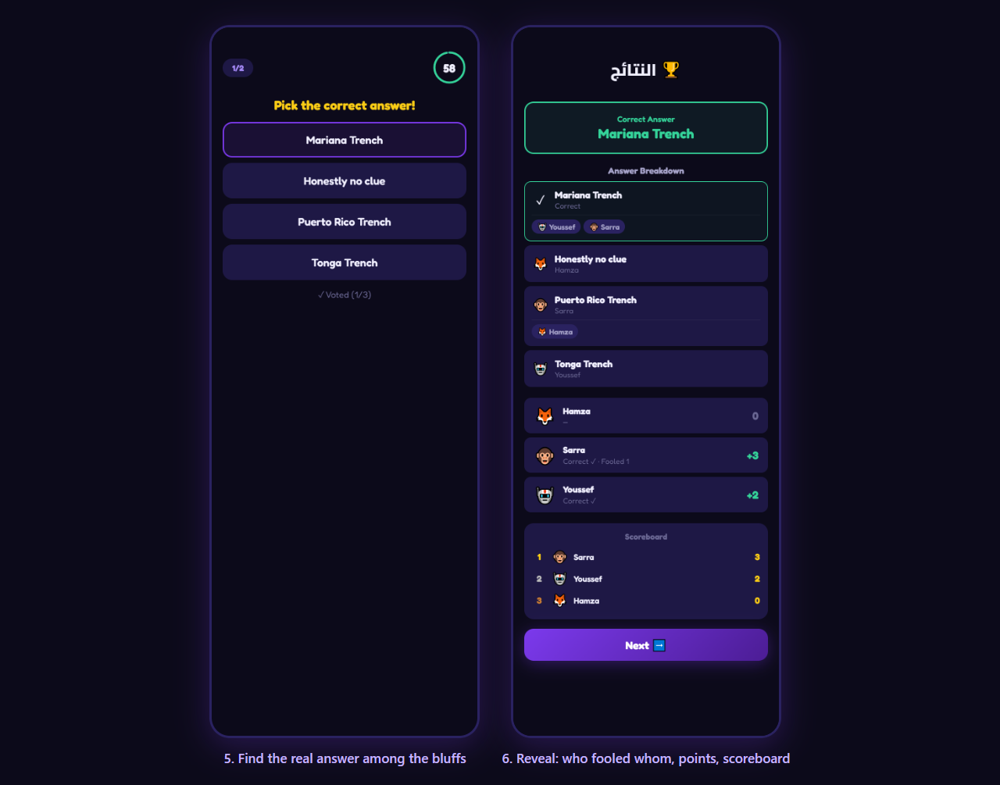
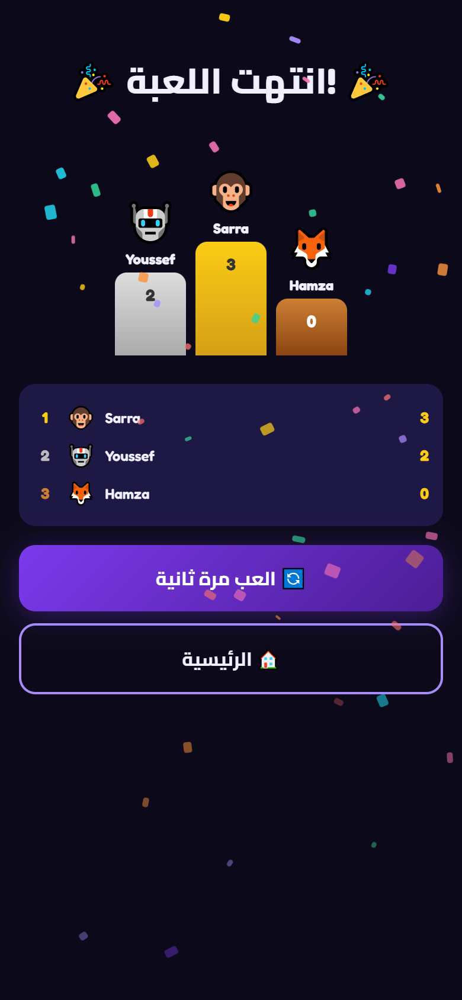

# Kalak (كَلَك) — a real-time trivia bluffing party game

A browser party game for 2–12 friends in the same room (or on the same Wi-Fi): everyone invents a fake answer to a trivia question, then tries to spot the real one among the bluffs. Built with Node.js, Express and Socket.io, with an Arabic-first (RTL) interface and an English question mode.

> Inspired by the Arabic party game *Kalak* and the "fibbing" genre of games such as *Fibbage*. This is an independent fan-made project for learning; it is not affiliated with the original game.





<p align="center"></p>

*Screenshots from a local 3-player session (three separate browser sessions on one machine), with the room set to English questions.*

---

## How to play

If you have never played a Kalak/Fibbage-style game, here is the idea:

1. **Create a room.** One player (the host) creates a room and gets a 5-character code. Friends open the same address on their phones, type the code (or open the share link), pick an avatar and a name.
2. **Pick a topic.** Each round, one player takes a turn choosing the category (Geography, History, Science, Sports, Food, Flags...). If they take longer than 15 seconds, one is picked at random.
3. **Write a bluff.** Everyone sees an obscure-sounding question, e.g. *"Deepest point in the ocean?"*. You don't answer it truthfully. You write a **convincing fake answer** ("Puerto Rico Trench") to trick the others.
4. **Find the truth.** The real answer is shuffled in with all the bluffs. Everyone votes for the one they think is real.
5. **Reveal.** The game shows which answer was real, who wrote each bluff, and who fell for it.

**Scoring**

| Event | Points |
| --- | --- |
| You vote for the real answer | +2 |
| Another player votes for *your* bluff | +1 per player fooled |

After the last round, a podium shows the top three and the host can start a new game with the same group.

## Features

- **Rooms with join codes**: 5-character codes (without look-alike characters such as `0/O` or `1/I`), a copy button and a `?room=CODE` share link.
- **Real-time multiplayer over WebSockets**: lobby, timers, answer and vote counters ("2/3 answered") update live on every screen.
- **Host settings**: categories, number of rounds (1–30), answer time (10–120 s), vote time (10–60 s), max players and question language (Arabic / English).
- **Rotating topic picker**: the player who picks the category changes each round.
- **Round breakdown**: every answer, who wrote it and who voted for it, plus round points and a running scoreboard.
- **Lobby chat**, avatar picker (30 emoji avatars), kick button for the host.
- **Final podium** with a CSS confetti animation.
- **Host tools panel** (`Ctrl+Shift+D` or `debug()` in the console): pause/resume the timer, skip a phase, end the game, add rounds, transfer host, kick players.
- **Mobile-first RTL UI** (Cairo + Fredoka fonts), designed to be played on phones around a table.
- **No database and no accounts**: all game state lives in server memory.

## Question bank

The questions are a **hand-written, hard-coded list inside `server.js`** (the `QUESTIONS` object). There is no external trivia API or database. There are **13 categories × 25 questions = 325 questions**, each stored in Arabic *and* English (`q`/`a` and `qE`/`aE`), so the host can switch the language of the questions. Within a game, questions are not repeated until a category has been used up.

Categories: General, Geography, History, Science, Sports, Entertainment, Technology, Food, Islam, Arab world, Literature, Animals, Flags.

## How it works

### Architecture

```
 phones / browsers (public/)                 Node.js server (server.js)
 ┌──────────────────────────┐   Socket.io   ┌──────────────────────────────┐
 │ index.html  (screens)    │ ◄───────────► │ Express: serves public/      │
 │ game.js     (UI + events)│   WebSocket   │ Socket.io: game events       │
 │ style.css                │               │ rooms: Map<code, Room>       │
 └──────────────────────────┘               │ QUESTIONS: 325 Q/A (AR + EN) │
                                            └──────────────────────────────┘
```

The server is the single source of truth. Clients only send intents (create/join, answer, vote...). The server validates them, advances the game and pushes the new state to everyone in the room. Correct answers are never sent to clients before the reveal. Vote options are sent as `{ text, id }` only, without who wrote them.

### Game state machine (per room)

```
 lobby ──game:start──► picking ──category chosen / 15 s──► question
   ▲                     ▲                                    │ all answered / answer timer
   │                     │ game:next (rounds left)            ▼
   │                  results ◄──all voted / vote timer──── voting
   │                     │ game:next (last round)
   └──game:restart── finished
```

A single server-side interval timer per room drives each phase (`setTimer`), broadcasts `timer:update` every second, and can be paused by the host. A phase also ends early as soon as every connected player has answered or voted.

### Socket.io event flow

| Direction | Event | Purpose |
| --- | --- | --- |
| client → server | `room:create`, `room:join` | create / join a room (with an ack callback) |
| client → server | `room:settings` | host changes settings |
| client → server | `game:start`, `game:next`, `game:restart` | host controls the flow |
| client → server | `game:pickCategory` | current picker chooses the topic |
| client → server | `game:answer`, `game:vote` | submit a bluff / a vote |
| client → server | `chat:send`, `debug:*` | lobby chat, host tools |
| server → clients | `room:state` | full room snapshot (players, scores, settings, host) |
| server → clients | `game:pick`, `game:question`, `game:vote`, `game:results`, `game:end` | phase changes |
| server → clients | `timer:update`, `game:answered`, `game:voted`, `chat:msg` | live counters, timer, chat |

When voting starts, bluffs that exactly match the real answer (case-insensitive) are dropped. The real answer and the bluffs are then shuffled (Fisher–Yates) before they are sent out.

## Run locally

Requirements: [Node.js](https://nodejs.org/) 18+ (tested with Node 22).

```bash
npm install
npm start            # http://localhost:3000
```

The port can be changed with the `PORT` environment variable:

```bash
PORT=3105 npm start          # macOS / Linux / Git Bash
$env:PORT=3105; npm start    # Windows PowerShell
```

### Playing on a LAN

The server listens on all network interfaces, so phones on the same Wi-Fi can join:

1. Find the host computer's local IP (`ipconfig` on Windows, `ip addr` / `ifconfig` on macOS/Linux), e.g. `192.168.1.20`.
2. On each phone, open `http://192.168.1.20:3000`.
3. One person creates the room; the others tap **Join** and type the code.

You may need to allow Node.js through the computer's firewall.

## Project structure

```
.
├── server.js          # Express + Socket.io server, room/game logic, question bank
├── public/
│   ├── index.html     # all screens (landing, profile, lobby, pick, question, vote, results, final)
│   ├── game.js        # client: screen switching, socket events, timers, rendering
│   └── style.css      # dark, mobile-first RTL theme and animations
├── docs/screenshots/  # README images
└── package.json
```

## Tech stack

- **Backend:** Node.js, Express 4, Socket.io 4
- **Frontend:** plain HTML, CSS and JavaScript (no framework, no build step), Socket.io client
- **Fonts:** Cairo and Fredoka (Google Fonts)

## Known limitations

- All state is kept in memory. Restarting the server ends every game, and a player who refreshes the page can't rejoin a game that has already started.
- Players can vote for their own bluff (it scores nothing), and two identical bluffs appear twice.
- The host's language setting changes the questions for everyone, but each player's interface language is set on their own device, and some labels are only in Arabic.
- The host tools panel can show everyone's answers during a round, so it is meant for testing, not competitive play.
- A few question-bank entries are debatable or duplicated.

## License

Not chosen yet. All rights reserved by the author until a license is added.
